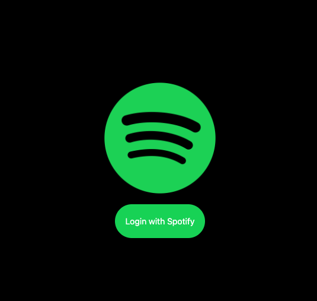
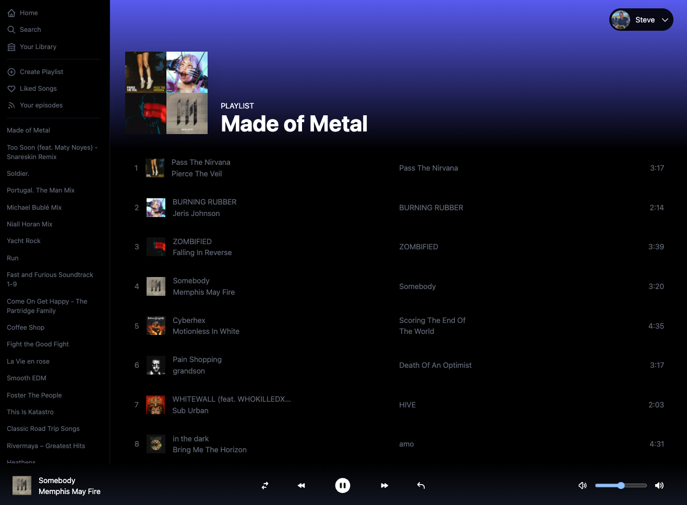

# Spotify 2.0

#
## Login 

This is a lean spotify clone which connects to a local spotify device once logged in. To begin using the app, simply click on "Login with Spotify" with the Spotify app open and logged in on your device. 

Once logged into the app, you can control the music playing by stopping and playing or changing playlists. Take note of the hover effects and changing background gradient as you refresh or click from one playlist to the next. Your favorite playlists from your account will automatically be imported into the app so there's no need to worry about adding them into the app. 

Using NextAuth allows for the Spotify Web API to authenticate the user and determine whether or not the user has a valid account. Tailwind allows for stunning hover effects when selecting playlists and gradient backgrounds. Recoil allows for the creation of playlist atoms to be able to use playlist information retrieved from the Spotify Web API globally throughout the code.

#
## Technologies Used

- Spotify Web API
- Next.js
- Next.js Middleware
- Tailwind
- NextAuth
- Recoil 
